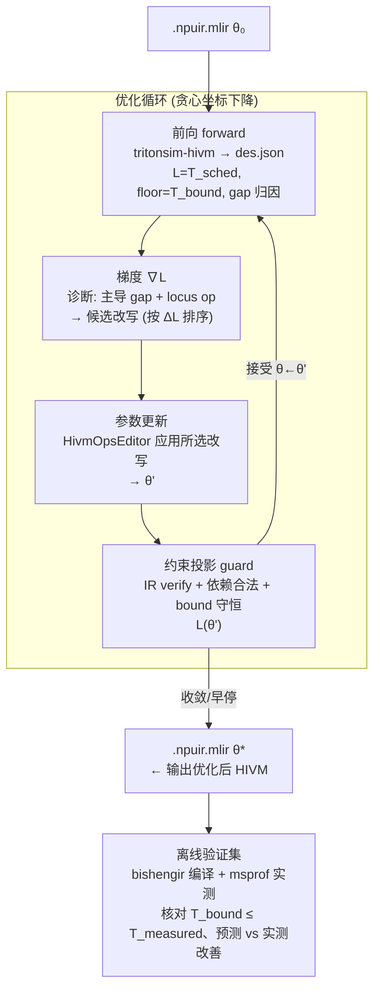

# 特性设计文档：Bound-Guided HIVM 自动改写器

> **一句话**：把「算子性能优化」建模成一次**梯度下降**——以 HIVM IR 为可训练参数、以解析调度时间为
> 损失、以 bound 分析的 gap 归因为梯度、以 `HivmOpsEditor` 的 IR 改写为参数更新，迭代产出**优化后的
> `.npuir.mlir`**，并用端到端验证循环保证每步「确实更快、且不违反理论下界」。
>
> **内容**：本文将给出方案、形式化、模块接口、里程碑与验收标准。
>
> **上游依据**（同目录）：`hivm_optimization_playbook.md`（21 条手段 → HIVM 重写规范）、
> `hivm_bound_vs_diagnosis_status.md`（bound/诊断现状与 file:line 证据）、
> `.omc/specs/performance_bound_model.md`（两层上界模型）。

---

# 第一部分 · 整体方案

## 1. 背景与目标

仓库已具备三块互补能力，但它们彼此独立、未闭环（详见 `hivm_bound_vs_diagnosis_status.md`）：

1. **解析 bound（Python `perfbound`）**：从 HIVM 算 `T_bound = max(T_grid, T_core+T_serial)` + 5 轴 gap 归因 + 双下界。
2. **瓶颈诊断（C++ `HIVMBottleneckDiagnoser` / Python `profile_utilization`）**：把瓶颈分到 5 类并给优化建议。
3. **HIR 改写执行器（C++ `HivmOpsEditor` / `hivm-crud`）**：MLIR 原生 load→改写 `hivm.*` op→export，**真正产出优化后 HIVM**。

**目标**：把三块串成一个**自动优化循环**——输入一份 `.npuir.mlir`，输出一份经多步改写、可编译、被模型证明
更优的 `.npuir.mlir`，全过程无需人工逐条试错，且每步可解释（归因到具体 gap 与具体改写）。

**为什么是「梯度下降」**：kernel 优化天然是「评估当前状态 → 找最痛的瓶颈（方向）→ 走一步改写 → 重新评估」的
迭代收敛过程。这与训练中「前向→反向→更新」同构。借用这套词汇能让循环、收敛、早停、约束、checkpoint
都有现成且严谨的定义，便于 AI agent 实现与调参。

## 2. 核心思想：优化循环 ≅ 训练循环

| 训练概念 | 本系统对应 | 来源 / 实现 |
|----------|-----------|------------|
| 参数 θ（weights） | HIVM IR：`.npuir.mlir` 的 op 序列与属性 | `HivmOpsEditor` 加载的 `ModuleOp` |
| 前向 forward | 调度 + 建模：`tritonsim-hivm` → `des.json` → `perfbound` | §6 forward harness |
| **损失 L(θ)** | `T_sched(θ)`：当前 IR 的**解析调度时间**（DES 关键路径，无需硬件） | `des.json` 的 `max(end_cycle)/clock_ghz` |
| 不可约下界（≈ Bayes error） | `T_bound(θ)`：该 IR 的理论可达最小时间 | `perfbound.compute_bounds/combine` |
| 梯度 ∇L（方向） | 诊断给出的「主导 gap + locus op + 推荐手段」 | `HIVMBottleneckDiagnoser` / gap 归因 |
| 候选步集 / 动作空间 | 21 条手段 → `HivmOpsEditor` 原语（playbook §9 映射） | §7.3 动作表 |
| 学习率 / step | 一次改写的粒度（一条 rewrite primitive 作用于一组 op） | actuator 单步 |
| 参数更新 θ←θ−η∇L | 用 `HivmOpsEditor` 应用所选改写，导出新 IR | `hivm-crud --apply` |
| 一个 step/epoch | 一轮 detect→select→rewrite→re-eval | §6 loop |
| mini-batch / 探索宽度 | beam 宽度 B（同时评估 top-B 候选，取最优） | 可选 |
| 收敛 | 无 gap 超阈值 ∨ L 不再下降 ∨ 无合法改写 | §7.4 |
| 早停 | 连续 k 步无改善 ∨ 触发约束回滚 | §7.4 |
| 正则 / 约束 | 合法性（RAW/WAR/buffer 容量/IR verify）+ bound 守恒 | guard，§7.5 |
| checkpoint | 每步导出的 `.npuir.mlir` + bound 快照 | history |
| 学习曲线 | `T_sched` 随 step 的下降曲线 + 各 gap 占比变化 | history 报告 |

> **诚实标注**：参数空间是**离散**的（op 与属性），所以严格说这是**贪心坐标下降 / best-improvement
> 搜索**（可加 beam → 近似 mini-batch），不是连续 SGD。「梯度下降」是**教学映射**，用于定义损失、方向、
> 步长、收敛与约束；实现按 §6 的离散贪心循环来写。

### 损失与下界的关系（关键设计）

- **L(θ) = T_sched(θ)**：DES 调度出的关键路径时间，是**便宜、可微观归因、无需硬件**的代理目标。
  循环全程最小化它。
- **T_bound(θ)**：理论下界，`T_sched ≥ T_bound` 恒成立（调度跑不过下界）。两类改写区别由它刻画：
  - **(A) 缩小 gap**：`T_bound` 不变，`T_sched` 向 `T_bound` 收敛（消除可避免的串行/低效）。
  - **(B) 降低 bound**：`T_bound` 自身下移（减流量/增算术强度/融合），`T_sched` 随之绝对下降。
- **归一化损失** `L_norm = (T_sched − T_bound) / T_bound ≥ 0`：衡量「还剩多少是可优化的 gap」。
  (A) 类把 `L_norm → 0`；(B) 类把分母也压下去。报告同时给 `T_sched`（绝对）与 `L_norm`（gap 占比）。

## 3. 系统全景



## 4. 概念与符号定义（实现需严格对齐）

| 符号 | 含义 | 计算来源 |
|------|------|----------|
| `θ` | 当前 HIVM IR（`.npuir.mlir`） | 文件 / `ModuleOp` |
| `T_sched(θ)` | 解析调度时间（µs）= `max(op.end_cycle)/clock_ghz` | `des.json`（`emitDESGraph` 已含 `start_cycle/end_cycle/clock_ghz`） |
| `T_bound(θ)` | 两层解析下界（µs） | `perfbound.combine.bound_combiner.combine → BoundResult.t_bound_us` |
| `gap_frac[k]` | 第 k 轴 gap 占 `T_bound` 比例 | `BoundResult.attribution`（grid/gap1..4） |
| `diag(θ)` | 诊断结果：每 op/流水/全局的 `BottleneckType` + locus + 建议 | `HIVMBottleneckDiagnoser`（需补 JSON 输出） |
| `L(θ)` | 损失 = `T_sched(θ)` | 同上 |
| `floor` | `T_bound(θ)` | 同上 |
| `δ` | 接受改写的最小 loss 改善量（µs 或相对） | 配置 |
| `ε` | 收敛阈值（`L_norm` 或主导 gap_frac） | 配置 |
| `k_patience` | 早停耐心步数 | 配置 |
| `B` | beam 宽度（每步评估的候选数，默认 1=纯贪心） | 配置 |

## 5. 现有可复用组件（不要重造）

| 能力 | 复用对象 | 位置 | 备注 |
|------|----------|------|------|
| 前向调度 + `des.json` | `tritonsim-hivm --npuir-file --des-graph-file` | `tools/tritonsim-hivm` | `des.json` 已含 per-op `start/end_cycle`、`clock_ghz` |
| 提取 → `HIVMExtract` | `extract_from_npuir` | `perfbound/extract/hivm_runner.py:41` | 子进程封装，可直接调 |
| 算 bound + gap | `compute_bounds` / `combine` | `perfbound/model/bounds.py`、`combine/bound_combiner.py` | `BoundResult` 即 floor+gap |
| 双下界 / headroom | `compute_two_limit` | `perfbound/combine/two_limit.py` | 报告用 |
| 诊断（IR 时刻） | `HIVMBottleneckDiagnoser` | `lib/AscendModel/Analysis/HIVMBottleneckDiagnosis.cpp` | **当前仅文本输出，需补 JSON** |
| HIR 改写执行器 | `HivmOpsEditor` | `include/AscendModel/Transforms/HivmOpsEditor.h` | 已含 `insertDoubleBuffering`/`fuseConsecutiveComputeOps`/`removeRedundantLoadStorePair`/`addSetFlagWaitFlag*`/`changeShape`… |
| 改写 CLI | `hivm-crud` | `tools/hivm-crud/hivm-crud.cpp` | **仅固定 demo 模式，需扩展为通用 `--apply spec.json`** |
| JSON 投影 counterfactual | `validate/hivm_edits.py`、`counterfactual.py` | `perfbound/validate/` | 无 bishengir 时的代理路径 |

## 6. 范围与非目标

**在范围内**：单 kernel、单核（busiest core）IR 的自动多步改写；(A)+(B) 两类手段；解析驱动的收敛；
离线验证集核对。

**非目标**（本特性不做）：① 重新标定硬件常数（A.1 校准已固定）；② 跨 kernel/全网搜索；③ 在循环内做真机
编译-运行（循环保持解析，硬件只在 §10 离线验证出现）；④ 修改 Triton DSL 或 grid（Tier-1 由上游 DSL extractor 提供，本循环聚焦 Tier-2 核内改写，grid 仅作为只读约束）。

---

# 第二部分 · 开发计划

## 7. 把循环形式化（实现前必须钉死的契约）

### 7.1 损失评估器 `LossEvaluator`

```python
# perfbound/optimize/loss.py
@dataclass
class Eval:
    t_sched_us: float          # L(θ)
    t_bound_us: float          # floor
    l_norm: float              # (t_sched - t_bound)/t_bound
    gap_frac: dict[str, float] # {"grid","gap1",...,"gap4"}
    binding: str               # binding component/tier
    schedule_truncated: bool   # des.json 标志，截断则该评估不可信
    raw_des_path: Path

def evaluate(npuir_path: Path, *, hw_config: Path | None = None,
            arg_bindings: dict[str,int] | None = None) -> Eval:
    """前向：跑 tritonsim-hivm 出 des.json，算 T_sched 与 T_bound/gap。
    T_sched = max(op.end_cycle for op in des.operations) / des.clock_ghz  (µs)
    复用 extract_from_npuir + compute_bounds/combine。"""
```

> 实现注意：`T_sched` 直接从 `des.json` 读，**无需新增 C++**（字段已存在）。若 `schedule_truncated=true`
> 必须把该 step 标为无效并早停（DES 命中 maxIterations，结果不可信）。

### 7.2 梯度（诊断 → 候选改写）`GradientProvider`

```python
# perfbound/optimize/gradient.py
@dataclass
class Candidate:
    rewrite: str                 # 原语名, e.g. "barrier_to_p2p"
    locus_op_ids: list[int]      # 作用的 op（des.json id）
    params: dict                 # 原语参数
    est_delta_loss_us: float     # 预估 ΔL（用 gap 归因近似，越负越好）
    gap_axis: str                # 归属 gap，用于解释
    kind: str                    # "A"(缩 gap) | "B"(降 bound)

def candidates(ev: Eval, diag: DiagReport) -> list[Candidate]:
    """把诊断主导 gap + locus 映射成排序后的候选改写。
    映射表见 §7.3；est_delta_loss 用对应 gap 的绝对 µs 作一阶近似。"""
```

诊断来源二选一（建议先用 C++，实测口径作交叉校验）：
- C++ `HIVMBottleneckDiagnoser`：**需补 `emitDiagnosisJSON()`**（当前只 `print` 文本）。
- Python `analyze_operator_bottleneck`（`profile_utilization.py:235`）：现成，但口径是实测式，循环内用调度量替代实测量即可。

### 7.3 动作空间（手段 → `HivmOpsEditor` 原语，摘自 playbook §9）

| gap 轴 | 手段 | rewrite 名 | `HivmOpsEditor` 原语 | kind |
|--------|------|-----------|---------------------|------|
| Gap3 | 双缓冲重叠 | `double_buffer` | `insertDoubleBuffering` | A |
| Gap3 | barrier→p2p | `barrier_to_p2p` | `addSetFlagWaitFlag*`+`deleteSyncOpsForOp` | A |
| Gap2/MTE | 减冗余搬运 | `dedup_gm_trip` | `removeRedundantLoadStorePair`/`deleteRedundantGMTrips` | A/B |
| Gap4 | 融合向量 | `fuse_vector` | `fuseConsecutiveComputeOps` | A |
| Gap3 | prefetch→L1 | `prefetch_l1` | `addND2NZ*`+`changeMemorySpace` | A |
| floor | 增大 tile/K | `enlarge_tile` | `changeShape`/`addMmadL1*` | B |
| Gap3+grid | CV split | `cube_vector_split` | `addSyncBlockSet/Wait*` | A |

> **首批只实现 kind=A 且原语为「直接便捷方法」的三条**：`double_buffer`、`fuse_vector`、`dedup_gm_trip`
> （零新原语，最快打通端到端）。其余在后续里程碑补。

### 7.4 收敛与早停

```
收敛(任一)：  L_norm ≤ ε
            ∨ max gap_frac ≤ ε
            ∨ 候选集为空（无合法改写）
早停(任一)：  连续 k_patience 步 ΔL > −δ（无实质改善）
            ∨ schedule_truncated
            ∨ step ≥ max_steps
```

### 7.5 约束投影（guard）—— 正则项，硬约束，违反即回滚

每步 `θ→θ'` 后必须全部通过，否则回滚并尝试下一候选：

1. **IR 合法**：`HivmOpsEditor` 导出的 IR 能被 `tritonsim-hivm` 重新解析（parse + verify 不报错）。
2. **依赖合法**：不破坏 RAW/WAR（用 `read/write_buffers`+`*_versions` 校验）；不超 buffer 容量
   （`enlarge_tile` 须过 `UnifiedTilingCostModel` buffer check）。
3. **下界守恒**：(A) 类改写后 `T_bound` 不变（容差内）；(B) 类改写后 `T_bound` 下降且仍 `≥` 不可违反。
4. **单调改善**：`L(θ') ≤ L(θ) − δ`，否则拒绝（best-improvement）。

## 8. 端到端验证循环（伪代码：训练主循环）

```python
# perfbound/optimize/loop.py
def optimize(npuir_path, cfg) -> OptimizeResult:
    theta = checkpoint0 = npuir_path
    ev = evaluate(theta)                         # forward
    history = [Snapshot(step=0, theta=theta, ev=ev)]
    no_improve = 0

    for step in range(1, cfg.max_steps + 1):
        if converged(ev, cfg) or ev.schedule_truncated:
            break
        diag = diagnose(theta)                   # C++/Python 诊断
        cands = rank(candidates(ev, diag))       # 梯度：按 est_delta_loss 排序
        applied = None
        for cand in cands[:cfg.beam]:            # mini-batch / line search
            theta2 = actuate(theta, cand)        # 参数更新 (HivmOpsEditor)
            if not guard_legal(theta, theta2, cand):   # 正则/约束
                continue
            ev2 = evaluate(theta2)               # 重新前向
            if guard_bound(ev, ev2, cand) and ev2.t_sched_us <= ev.t_sched_us - cfg.delta:
                applied = (theta2, ev2, cand); break
        if applied is None:
            no_improve += 1
            if no_improve >= cfg.k_patience: break
            continue
        theta, ev, cand = applied               # accept θ←θ'
        no_improve = 0
        history.append(Snapshot(step, theta, ev, cand))   # checkpoint + 学习曲线

    return OptimizeResult(best=theta, history=history,
                          report=render(history))          # T_sched 下降曲线 + 每步归因
```

**离线验证集（§3 下半部，训练完做一次，对应「测试集评估」）**：
对 n≥3 个验证 kernel 跑 `optimize`，再用 `perfbound/validate/{counterfactual,harness}.py` +
`bishengir` 编译 + `msprof` 实测，核对两件事：
1. **守恒**：`T_bound ≤ T_measured`（理论从未高估速度）；
2. **方向正确**：预测的 `T_sched` 改善与实测时间改善同号、量级相符（不要求精确，要求趋势一致）。

## 9. 模块分解与落点

```
perfbound/optimize/                     ← 新增 Python 包（编排器 = optimizer）
  __init__.py
  loss.py        # LossEvaluator: evaluate() → Eval     (§7.1)
  gradient.py    # GradientProvider: candidates()       (§7.2/7.3)
  actuator.py    # 调 hivm-crud/HivmOpsEditor 应用改写   (§7.3)
  guard.py       # 合法性 + 下界守恒 + 单调改善          (§7.5)
  loop.py        # optimize(): 主循环 + history          (§8)
  report.py      # 学习曲线/归因报告 (md + 可选 json)
  cli.py         # python -m perfbound.optimize --kernel ...

C++ 侧改动（最小）：
  HIVMBottleneckDiagnosis.{h,cpp}       ← 补 emitDiagnosisJSON()（机器可读诊断）
  tools/hivm-crud/hivm-crud.cpp         ← 扩展 --apply <spec.json>：按 spec 顺序调原语
  （可选）include/.../HivmOpsEditor.h    ← 若需 reorder，新增 moveOpBefore/After
```

**`hivm-crud --apply spec.json` 契约**（actuator 与 CLI 的接口，先钉死）：
```json
{ "rewrites": [
    {"primitive": "insertDoubleBuffering",
     "target_op_id": 7, "params": {"set_pipe":"PIPE_V","wait_pipe":"PIPE_MTE2","event_id":2}}
] }
```
CLI 加载 `.npuir.mlir.bak` → 按 `rewrites` 顺序在对应 op 上调 `HivmOpsEditor` 方法 → `exportToFile`。

## 10. 里程碑与验收标准

| 里程碑 | 内容 | 验收标准（DoD） |
|--------|------|----------------|
| **M0 契约** | 定下 `Eval`/`Candidate`/`spec.json`/诊断 JSON 四个 schema | 四个 schema 写成 `docs/` + 失败测试占位；评审通过 |
| **M1 前向** | `loss.evaluate()`：从 `des.json` 算 `T_sched` + 复用 `compute_bounds` | 对 `test/hivm_add_kernel`、`hivm_mixed_cv_kernel` 输出 `Eval`，`T_sched ≥ T_bound`、`l_norm ≥ 0`；有单测 |
| **M2 执行器** | `hivm-crud --apply spec.json` + `actuator.py`；首批 3 原语 | 对两个 fixture round-trip：应用 `double_buffer`/`fuse_vector`/`dedup_gm_trip` 后导出 IR 可被重新解析；`verify_edit_via_extract` 报告模型可见变化 |
| **M3 梯度** | `HIVMBottleneckDiagnoser::emitDiagnosisJSON` + `gradient.candidates()` | 诊断 JSON 含 per-op `BottleneckType`+locus；`candidates()` 对「故意注入 PIPE_ALL barrier」的 fixture 给出 `barrier_to_p2p`/`double_buffer` 候选并排序 |
| **M4 闭环** | `guard.py` + `loop.optimize()` + `report.py` | 对 ≥2 fixture：循环在 `max_steps` 内收敛或正确早停；`T_sched` 单调不增；产出优化后 `.npuir.mlir` + 学习曲线；每步归因可读；非法改写被回滚 |
| **M5 验证集** | 离线 `bishengir` 编译 + `msprof` 核对 | n≥3 kernel：`T_bound ≤ T_measured` 全部成立；预测改善与实测改善同号 |

## 11. 测试策略

- **单元**：`loss`（`T_sched` 计算、截断处理）、`gradient`（映射表、排序）、`guard`（注入非法改写须拒绝）、
  `actuator`（spec→IR diff）。
- **集成**：fixture 上跑完整 `optimize`，断言收敛/早停、单调性、IR 可重解析。
- **counterfactual 一致性**：同一手段的 JSON 代理（`hivm_edits.py`）与真实 HIR 改写（`HivmOpsEditor`）
  对模型量的影响方向一致（防止两条落地实现语义漂移）。
- **回归**：现有 `tests/perfbound/*` 全绿（不破坏 bound/extract）。

## 12. 风险与缓解

| 风险 | 影响 | 缓解 |
|------|------|------|
| `T_sched`（DES 估计）与真机偏差 | 循环朝错误方向走 | M5 验证集核对趋势；偏差大的手段先只信「方向」不信「幅度」 |
| 贪心陷局部最优 | 错过更优组合 | beam（B>1）+ 随机重启；记录被拒候选供分析 |
| `HivmOpsEditor` 需 bishengir 方言（`TRITONSIM_HAS_BISHENGIR_HIVM`） | 无方言环境跑不动改写 | 退回 `hivm_edits.py` JSON 代理路径跑循环（产物为 JSON 而非可编译 HIR），CI 双轨 |
| 合法性判定不全引入 race | 产出错误 kernel | guard 默认保守：依赖不确定一律拒绝；M5 编译实测兜底 |
| 诊断两套口径漂移（C++ vs Python） | 候选不稳定 | M3 用同一组 fixture 交叉校验，差异写回 status 文档 |
| reorder 无底层原语 | §3③ 手段缺失 | 标记为 M4 之后；先用 delete+create 间接或新增 `moveOp` |

## 13. 给实现者的最小起步清单

1. 建 `perfbound/optimize/` 骨架与 `cli.py`（`python -m perfbound.optimize --kernel k.npuir.mlir`）。
2. 实现 `loss.evaluate()`（M1）——这是最小可跑前向，先让 `T_sched/T_bound` 在两个 fixture 上出数。
3. 扩展 `hivm-crud --apply spec.json` + `actuator.py`，接通**一条** `fuse_vector`（M2）。
4. 用「写死单条候选」的最简 `loop`（跳过诊断）跑通 detect→rewrite→re-eval→guard 一圈，验证 `T_sched` 下降。
5. 再补 `emitDiagnosisJSON` + `gradient`（M3），把「写死候选」换成「诊断驱动候选」。
6. 补 `guard`/`report`/早停，做成完整循环（M4），最后接离线验证（M5）。

> 实现顺序的原则与训练一致：**先让 forward+loss 能算，再让 update 能走一步，再让 gradient 指方向，
> 最后加约束与早停**。每步都能在 `test/*.npuir.mlir` 上独立验收，避免一次性大改。
