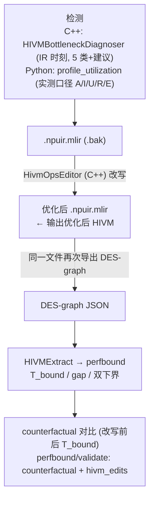
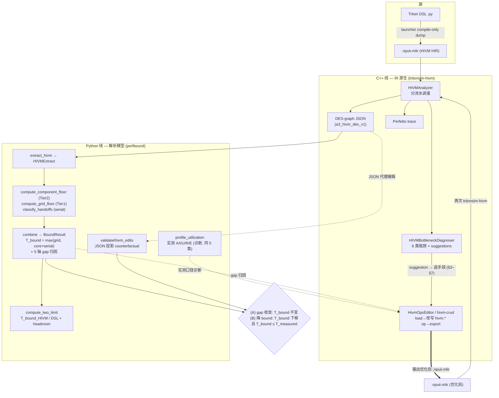

# HIVM 优化手册：从性能问题到「优化后 HIVM」

> 目标：把 5 类常见性能问题的 21 条常规优化手段，逐条落到 **HIVM 层面**——
> 给出「检测信号 → HIVM 变换 → before/after IR → 对模型量的影响 → 落地与合法性」，
> 最终产出**优化后的 HIVM**（`.npuir.mlir` HIR，并以 DES-graph JSON 作为模型可消费/可验证的投影）。

本手册与 `.omc/specs/performance_bound_model.md` 的两层上界模型、以及 `perfbound/`
归因管线严格对齐：每条手段都标注它**缩小哪个 gap** 或**降低哪个 floor**。

---

## 0. 两个 HIVM 工件，先分清

「优化后的 HIVM」存在两种表示，本手册始终区分：

| 工件 | 形态 | 谁产生 / 谁消费 | 本手册的角色 |
|------|------|----------------|--------------|
| **HIVM HIR** | `.npuir.mlir` 文本（`hivm.*` op，MLIR `ModuleOp`） | bishengir 编译产出 / 人工 author；`tritonsim-hivm --npuir-file` 消费；**`HivmOpsEditor`（C++）加载/改写/导出** | **优化的真正落点**——重写它 = 输出优化后 HIVM |
| **DES-graph JSON** | `a3_hivm_des_v1`（`operations[]`） | `emitDESGraph()`（C++）产出；`perfbound` 模型 + `validate/hivm_edits.py` 消费 | 模型分析投影 + counterfactual 验证介质 |

> **代码更新（PR#20/#17 已合入 `integrate/pr20-pr17`）后的关键变化**：HIR 的「执行器」已经**不再是
> 待建**——PR#20 引入了 MLIR 原生的 **`HivmOpsEditor`**（`include/AscendModel/Transforms/HivmOpsEditor.h`）
> 与 CLI **`hivm-crud`**，能 `loadFromFile(.npuir.mlir.bak)` → 改写 `hivm.*` op → `exportToFile(.npuir.mlir)`，
> **直接产出优化后 HIVM HIR**。它内置了本手册多条手段的现成原语（见 §9 重写后的现状表）。
> 注意：`HivmOpsEditor` 整体受 `#ifdef TRITONSIM_HAS_BISHENGIR_HIVM` 保护，需启用 bishengir HIVM 方言才编译。

一条优化的完整闭环（两条实现线交汇，§2.5 有更完整的版本）：



两条线的分工：
- **C++（IR 原生线）**：调度 + 诊断（`HIVMBottleneckDiagnoser`）+ **HIR 改写/导出（`HivmOpsEditor`/`hivm-crud`）**——
  真正「输出优化后 HIVM」的执行器。
- **Python（解析模型线）**：消费 DES-graph JSON → 算 `T_bound`/gap/双下界（`perfbound`）；
  `validate/hivm_edits.py` 在 **JSON 投影**上做 source-to-source 编辑（`raise_repeat`/`insert_pingpong`/
  `merge_transfers`），作为不需要 bishengir 即可跑的 counterfactual 快速代理。

二者共享下面的重写词汇表，并在 DES-graph JSON 这一契约上交汇。

---

## 1. HIVM 重写词汇表（变换的最小操作集）

来自 `test/hivm_mixed_cv_kernel.npuir.mlir` / `hivm_add_kernel.npuir.mlir` 与
`include/AscendModel/Analysis/HIVMAnalysis.h::HIVMOp`。

### 1.1 算子（HIR op）

| HIR op | 流水 (pipe) | 语义 | src→dst space |
|--------|------------|------|---------------|
| `hivm.hir.load` | `PIPE_MTE2` | GM→UB 搬入 | gm→ub |
| `hivm.hir.store` | `PIPE_MTE3` | UB→GM 搬出 | ub→gm |
| `hivm.hir.nd2nz` | `CubeMTE2` | GM→L1 布局转换搬入（cube 路径，≈0.5×带宽） | gm→cbuf(l1) |
| `hivm.hir.mmadL1` | `PIPE_M`(Cube)/`MTE1` | L1→L0A/B + 矩阵乘 | cbuf→cc(l0c) |
| `hivm.hir.fixpipe` | `PIPE_FIX` | L0C→UB 回写/量化 | cc→ub |
| `hivm.hir.vadd`/`vmul`/… | `PIPE_V`(Vector) | UB 内逐元素计算 | ub→ub |
| `hivm.hir.pointer_cast` | — | 在某 space 分配 buffer（含 multi-buffer slot） | — |

### 1.2 同步原语（这是 SyncOverhead 一类的主战场）

```mlir
// 点对点（per-pipe）信号：生产 pipe SRC 通知消费 pipe DST，事件号 EVENT
hivm.hir.set_flag [<SRC_PIPE>, <DST_PIPE>, <EVENT_ID>]
hivm.hir.wait_flag[<SRC_PIPE>, <DST_PIPE>, <EVENT_ID>]

// 全局屏障：所有 pipe / 跨核全停等
hivm.hir.pipe_barrier[<PIPE_ALL>]
```

- 一对 `set_flag/wait_flag` ⇒ DES 中 `is_sync=true`、`event_id`、`event_generation`、
  `sender_pipe`、`receiver_pipe`。DES 调度按 `(event_id, generation, source_core)` 配对，
  支持 AIC↔AIV 跨核（见 `mixed_cv` 中 `PIPE_M→PIPE_FIX→PIPE_V` 链）。
- `pipe_barrier[<PIPE_ALL>]` ⇒ `is_barrier=true`，计入 `barrier_cycles`，让**所有** pipe
  在该点对齐——这是同步开销的主要来源。

### 1.3 可改写的 HIVMOp 字段（DES-graph 侧，模型直接读）

`id, pipe, depends_on[], is_sync, is_barrier, event_id, event_generation,
sender_pipe, receiver_pipe, core_type, bytes, elements, flops, loop_multiplier,
multi_buffer_slots, read_buffers[]/write_buffers[], read_versions[]/write_versions[],
src_space, dst_space, elem_type, repeat, mask`

> 关键映射：`repeat/mask`→Gap4；`bytes`+`src/dst_space`→MTE floor & Gap2；
> `is_barrier`/`is_sync`/`event_*`→同步开销 & Gap3；`multi_buffer_slots`+`*_versions`→
> 流水重叠 & Gap3；`core_type`→Tier-1 双核/负载均衡；`flops`+tile 维→Compute floor。

---

## 2. 问题类 ↔ 模型五轴 gap 映射（总表）

模型把「与上界的距离」分解为 5 轴（grid + 4 gap），并区分**两种优化**：
**(A) 缩小 gap**——不改变 `T_bound`，让实测向下界收敛（调度/同步/buffer 类）；
**(B) 降低 bound**——改变计算量/流量，`T_bound` 本身下移（tiling/fusion/降流量类）。
### 五轴 gap 表

| Gap 类别 | 问题来源 | 典型表现 / 原因 | 优化方向 |
|---------|----------|----------------|----------|
| grid | 线程网格/工作组划分不合理 | 硬件占用率不足（occupancy 低）；各处理单元负载不均衡 | 调整 grid/block 尺寸、优化任务分配策略，充分利用计算资源 |
| gap1 | 错误单元放置（算子分配到次优硬件单元） | 本该跑在 Cube 的矩阵运算被放到了 Vector 单元；单元选择与算子特性不匹配 | 改进算子映射 cost model；手工引导调度，让计算密集部分使用最强算力单元 |
| gap2 | 合并/传输效率低（MTE、DMA 等） | 小包传输无法摊平开销；地址未对齐；未用满突发传输能力 | 合并小传输、数据对齐、增大 burst 长度、利用 MTE2 预取 |
| gap3 | 可避免的串行化（生产-消费 handoff） | 通过 ping‑pong buffer 或软件流水可消除的同步等待，属于 `T_serial` 中可优化的部分 | 引入多缓冲/双缓冲/软件流水线，重叠执行，消除显式等待点 |
| gap4 | 单元内执行效率低（SIMD / 矩阵引擎） | SIMD 通道利用率低（向量长度不足、掩蔽浪费）；矩阵 K 维度未填满硬件流水 | 合并向量运算、增大 tile 尺寸、调整循环次数以匹配 SIMD 宽度或 Cube 的 K 维度 |

| bound归因分类             | 主导模型量 | 对应 gap 轴 | 论文 fix | 优化性质 |
|-----------------------|-----------|-------------|----------|----------|
| **SyncOverhead**      | `barrier_cycles` / 暴露控制 / Gap3 | Gap3（R 轴，MTE/控制） | RUS, PP, RSD, AIS-reorder | 主要 (A) |
| **BandwidthBound**    | MTE-GM floor / Gap2 / Gap3 | Gap2(E轴)+Gap3(R轴)+floor | ITG, MRT, TT, PP | (A)+(B) |
| **StartupOverhead**   | per-op 启动延迟（E 轴） | Gap2 / Gap4 startup 分量 | ITG, AIP, OP-fusion | (A) 偏 (B) |
| **ComputeBound**      | Cube/Vector floor / Gap4 | 多为 floor（非 gap）+ Gap4 | EA, AIP, OP-fusion | 主要 (B) |
| **PipelineImbalance** | Tier-2 重叠 / cv-balance / Tier-1 | Gap3 + grid | PP, Cube-Vector split | (A) |

> 注意一个论文级判断：当某 component 利用率已逼近其 ideal（如 ComputeBound 的纯算力打满），
> **那不是 gap**——只能靠 (B) 降低 bound（增大算术强度、融合、降精度），不能靠调度收敛。
> 本手册对每条手段都标注 (A)/(B)。

---

## 2.5 两条实现线：C++（IR 原生）与 Python（解析模型）

代码现状里，「检测 → 改写 → 验证」分布在两条独立、在 **DES-graph JSON** 处交汇的实现线上。
理清这两条线，才能知道每条手段「在哪写、用什么写、怎么验」。

### C++ 线（IR 原生：调度 / 诊断 / 改写）

| 角色 | 符号 / 工具 | 文件 | 职责 |
|------|------------|------|------|
| 调度分析 | `HIVMAnalyzer` | `lib/AscendModel/Analysis/HIVMAnalysis.cpp` | 解析 `.npuir.mlir`，分流水调度，导出 DES-graph JSON / Perfetto |
| **诊断** | `HIVMBottleneckDiagnoser` | `lib/AscendModel/Analysis/HIVMBottleneckDiagnosis.cpp` | 从调度结果分类 6 类瓶颈（= 你的 5 类 + LowParallelism）+ 给 suggestions |
| **改写（执行器）** | `HivmOpsEditor` | `include/AscendModel/Transforms/HivmOpsEditor.h` | MLIR 原生 CRUD：load `.bak` → 改 `hivm.*` op → export `.npuir.mlir` |
| CLI | `hivm-crud` | `tools/hivm-crud/hivm-crud.cpp` | `--mode read/add/delete/modify/roundtrip`、`--remove-gm-trips N` 的薄封装 |

C++ 线**直接操作真实 HIR**，是「输出优化后 HIVM」的落点。诊断与改写都在 IR 时刻（无需实测）。

### Python 线（解析模型：bound / 归因 / counterfactual）

| 角色 | 符号 | 文件 | 职责 |
|------|------|------|------|
| 提取 | `extract_from_npuir` / `extract_hivm` | `perfbound/extract/hivm_runner.py`、`hivm_extractor.py` | 调 C++ 工具导出 DES-graph JSON → `HIVMExtract` |
| **bound** | `compute_bounds` / `combine` | `perfbound/model/bounds.py`、`perfbound/combine/bound_combiner.py` | 两层 `T_bound = max(grid, core+serial)` + 5 轴归因 |
| 双下界 | `compute_two_limit` | `perfbound/combine/two_limit.py` | `T_bound_HIVM` vs `T_bound_DSL` + headroom |
| 诊断（实测口径） | `analyze_operator_bottleneck` | `perfbound/analyze/profile_utilization.py` | 与 C++ 诊断同套 5 类，但从实测 A/I/U/R/E 判 |
| counterfactual | `hivm_edits` / `counterfactual` | `perfbound/validate/*.py` | 在 **JSON 投影**上做代理编辑，不需 bishengir |

Python 线**不碰 HIR**，只消费 C++ 导出的 JSON 算量化 bound，并以 JSON 编辑做快速 counterfactual。

### 两线交汇 = 优化闭环（mermaid）



> 关键点：诊断（C++ `HIVMBottleneckDiagnoser` / Python `profile_utilization`）给出**手段选择**，
> C++ `HivmOpsEditor` 执行**HIR 改写**并产出优化后 `.npuir.mlir`，Python `perfbound` 在改写前后各算一次
> `T_bound` 做**收敛验证**。三段恰好是「诊断—执行—度量」，分属两条线但闭环。

---

## 3. SyncOverhead — 同步开销（主战场：set_flag/wait_flag、pipe_barrier）

检测信号：DES 报告 `barrier_cycles` 占比高；关键路径上 `wait_flag` 的 `start_cycle`
远晚于其匹配 `set_flag` 的 `end_cycle`（暴露的 stall）；A.8 暴露控制/同步赤字
（`exposed_control_deficit_*`）为正。

### ① `pipe_barrier` → per-pipe `set_flag/wait_flag`  —— (A) 缩小 Gap3（RUS）

把粗粒度全局屏障替换为只约束真实生产者/消费者 pipe 的点对点信号，让无关 pipe 继续跑。

**before**（vadd 之后用全局屏障保护 store）：
```mlir
hivm.hir.vadd  ... outs(%ub2 : ...ub>)        // PIPE_V 写 %ub2
hivm.hir.pipe_barrier[<PIPE_ALL>]             // ★ 所有 pipe 全停
hivm.hir.store ins(%ub2 ...) outs(%dst ...)   // PIPE_MTE3 读 %ub2
```
**after**：
```mlir
hivm.hir.vadd  ... outs(%ub2 : ...ub>)
hivm.hir.set_flag [<PIPE_V>, <PIPE_MTE3>, <EVENT_ID3>]  // 仅 V→MTE3
hivm.hir.wait_flag[<PIPE_V>, <PIPE_MTE3>, <EVENT_ID3>]
hivm.hir.store ins(%ub2 ...) outs(%dst ...)
```
DES 影响：`is_barrier` 项消失，`barrier_cycles`↓；其它核/pipe（如下一 tile 的 MTE2 load）
不再被这点拉平 → 关键路径缩短，Gap3↓。**合法性**：仅当 barrier 的全部跨 pipe 顺序约束
都被新插入的 set/wait 边覆盖时才合法（否则引入 race）——重写器须用 `read/write_buffers`
+`*_versions` 的 RAW/WAR 依赖证明覆盖完整。

### ② multi-buffer pipelining 降低屏障频率 —— (A) 缩小 Gap3（PP/RSD）

把每轮迭代结尾的屏障，换成「双 slot + 版本轮换」，使第 i+1 轮 load 不必等第 i 轮消费完。

HIVM 变换：`pointer_cast` 分配 2 个 slot（`multi_buffer_slots: 2`）；偶/奇迭代交替写
`write_versions=[v]`、读 `read_versions=[v-1]`；屏障从内层移到外层（频率 1/2）。
DES 影响：producer/consumer 跨迭代重叠，关键路径中 MTE 被 compute 覆盖。
**落地**：现有 `insert_pingpong()` 在 DES-graph 上以「复制 MTE_UB op」近似此效果；HIR 级
需真正分配双 buffer 并改版本号。

### ③ reorder ops 减少 wait stall —— (A) 缩小 Gap3（AIS-reorder）

在 `set_flag` 与 `wait_flag` 之间塞入与该事件无关的独立 op，使 `wait_flag` 到达时信号已就绪。

**before**（load 之后立刻 wait，stall 暴露）：
```mlir
hivm.hir.load  %src0 -> %ub0
hivm.hir.set_flag [<PIPE_MTE2>,<PIPE_V>,<E0>]
hivm.hir.wait_flag[<PIPE_MTE2>,<PIPE_V>,<E0>]   // V 在此干等 load
hivm.hir.vadd  %ub0,%ub1 -> %ub2
```
**after**（把第二个独立 load 提前到 wait 前，填满等待窗口）：
```mlir
hivm.hir.load  %src0 -> %ub0
hivm.hir.load  %src1 -> %ub1            // ← 独立 load 上移，占住 V 等待时间
hivm.hir.set_flag [<PIPE_MTE2>,<PIPE_V>,<E0>]
hivm.hir.wait_flag[<PIPE_MTE2>,<PIPE_V>,<E0>]
hivm.hir.vadd  %ub0,%ub1 -> %ub2
```
DES 影响：`wait_flag.start_cycle` 不变但其后续 compute 的暴露等待被独立 work 吸收，关键路径↓。
**合法性**：被移动 op 与跨越区间内所有 op 无 buffer 依赖（用 `depends_on`/版本验证）。

### ④ 全局：减少全局屏障，用 per-pipe sync —— (A) 缩小 Gap3（RUS，①的全局化）

扫描整个 kernel，删除「其顺序已被既有 set/wait 边蕴含」的冗余 `pipe_barrier[<PIPE_ALL>]`。
判定：对每个 barrier，若它分隔的每一对真实依赖 (producer_pipe,consumer_pipe) 都已存在
匹配的 set/wait（或可安全补一条点对点边），则该 barrier 冗余可删。模型影响同①，作用于全核。

### ⑤ 全局：多 buffer 解耦 producer/consumer —— (A) 缩小 Gap3（PP，②的结构化）

对整条 producer→consumer 链做结构化双/多缓冲（depth≥2），使两端完全解耦、稳态下各自打满。
HIVM 变换：链上每个中间 buffer 升为 N-slot，`multi_buffer_slots=N`，版本轮换；sync 退化为
环形依赖。模型影响：Tier-2 中两 component 从「串行相加」变「max 并行」，`T_serial` 仅剩首/尾
填充，Gap3 趋零。

---

## 4. BandwidthBound — 带宽受限（主导：MTE-GM floor + Gap2/Gap3）

检测信号：`binding_component == MTE_GM`，其 `U` 高而 compute `U` 低；或 Gap2（合并/对齐）
分量大。

### ① 减少数据搬运（in-place / tiling reuse） —— (B) 降低 MTE floor（MRT）

消除「已驻留 UB/L1 的算子重复 load」，或就地计算。`mixed_cv` 已示范就地：`vadd ins(%cv_ub,%cv_ub) outs(%cv_ub)`。

**before**（重复从 GM 读同一 operand）：
```mlir
hivm.hir.load %gm_x -> %ub_a   // tile i
...
hivm.hir.load %gm_x -> %ub_a2  // tile i+1 又读同一 %gm_x  ← 冗余 GM 流量
```
**after**（识别 `read_buffers` 同根 + 版本未变 → 删除第二次 load，复用 buffer）：
```mlir
hivm.hir.load %gm_x -> %ub_a   // 只读一次，后续复用 %ub_a
```
模型影响：`bytes`(MTE_GM)↓ → `O_mte_gm/I_mte_gm` floor 直接下移，**T_bound 本身下降**。
**落地**：DES-graph 上删冗余 MTE op；HIR 上删 `load` 并把消费者的 operand 改指向驻留 buffer。

### ② 传输与计算重叠（multi-buffer） —— (A) 缩小 Gap3

不减字节，但把 tile i+1 的 `load`(MTE2) 与 tile i 的 `vadd/mmad`(V/Cube) 重叠。机制同 §3②⑤。
模型影响：MTE-GM 退出关键路径（被 compute 覆盖），实测向 `max(MTE,Compute)` 收敛。

### ③ CubeMTE2 专有：提前 prefetch 到 L1 —— (A) 缩小 Gap3（TT/PP）

把 `nd2nz`（GM→L1/cbuf）提前到 mmad 之前若干步发射，沿 CubeMTE2 流水预取，隐藏 MTE1 输入等待。

**before**：
```mlir
hivm.hir.nd2nz %gm_a -> %a_l1     // 紧贴 mmad
hivm.hir.mmadL1 %a_l1,%b_l1 -> %c_l0c
```
**after**（prefetch 下一片 a，与当前 mmad 重叠）：
```mlir
hivm.hir.nd2nz %gm_a_next -> %a_l1_slot1   // ← 预取，发射提前
hivm.hir.mmadL1 %a_l1_slot0,%b_l1 -> %c_l0c
```
模型影响：CubeMTE2/MTE1 传输被 Cube 计算覆盖，Gap3↓。`src_space=gm,dst_space=cbuf` 不变。

### ④ 全局：减少总数据量 / 提高 tile reuse —— (B) 降低 floor（EA）

通过更大 tile 或循环重排提升 operand 复用，减少跨 tile 的 GM 重读（对应 Tier-1 `redundancy`
与 Tier-2 `bytes_in`）。模型影响：`bytes`↓ → MTE-GM floor↓，T_bound↓。属算法/tiling 轴。

### ⑤ 全局：software pipelining 重叠传输与计算 —— (A) 缩小 Gap3（②③的结构化）

整 kernel 软件流水（prologue/steady/epilogue），稳态下 MTE 与 Compute 完全重叠。模型影响同 §3⑤。

---

## 5. StartupOverhead — 启动开销（E 轴：每 op 固定启动延迟）

检测信号：op 数量多、单 op `bytes/elements` 小；DES 中传输/compute 的 `duration` 里启动占比高
（C++ 侧 `estimateND2NZCycles`/vector startup 的 `startupCycles` 分量）。

### ① 增大 tile size 摊薄 startup —— (B)→(A) 边界，降 E 轴损失（ITG）

每个 `load/nd2nz/vadd` 有固定 startup；tile 越大，startup 占比越小。
HIVM 变换：把 `memref<128x128>` 类形状放大到 `256x256`，相应 `loop_multiplier`↓、op 数↓。
模型影响：有效带宽/吞吐 E↑（`actual/ideal` 上升），Gap2/Gap4 的 startup 分量↓。
**约束**：受 L0/L1/UB 容量限制（`UnifiedTilingCostModel` 的 buffer check）——放大须过 buffer 约束。

### ② 融合相邻传输，减少 per-transfer overhead —— (A) 缩小 Gap2（ITG）

合并 `src_space/dst_space` 相同的相邻 `load`/`nd2nz` 为一次大传输：一次 startup 代替 N 次。

**before** → **after**：
```mlir
hivm.hir.load %gm_x0 -> %ub0     hivm.hir.load %gm_x01 -> %ub01  // 合并：bytes 求和，
hivm.hir.load %gm_x1 -> %ub1  ⇒  // 一次 startup（src/dst space 相同且地址连续才合法）
```
**落地**：现有 `merge_transfers()` 已实现此变换（DES-graph 上对相邻同 space MTE_GM 求和 bytes）。
模型影响：MTE op 数↓、总 startup↓ → Gap2↓。

### ③ 融合相邻 vector ops，减少 launch overhead —— (A)/(B) 缩小 Gap4 + 降 sync

把 UB 内相邻 `vadd→vmul→…` 融成一条向量指令链，省去中间 op 的 startup 与可能的 set/wait。

**before**：
```mlir
hivm.hir.vmul %ub_a,%ub_b -> %ub_t   // 启动+计算
hivm.hir.vadd %ub_t,%ub_c -> %ub_o   // 又一次启动
```
**after**（融合为一条 fma 链，单启动）：
```mlir
hivm.hir.vfma %ub_a,%ub_b,%ub_c -> %ub_o
```
模型影响：vector op 数↓、`repeat` 可提升（Gap4 改善）、潜在 sync 边减少。

---

## 6. ComputeBound — 计算受限（多为 floor，需 (B)；Gap4 是唯一 (A)）

检测信号：`binding_component ∈ {Cube, Vector}` 且其 `U ≥ u_threshold`（已逼近 roofline）。
此时**不是 gap**——纯调度收敛无效，须降低 bound 或修 Gap4 执行效率。

### ① Cube 专有：增大 K 维提高算术强度 —— (B) 降低 Cube floor（EA）

`mmadL1 ins(%a_l1,%b_l1,%true,%M,%N,%K)` 的 K（第 6 个 index 参数）增大：MTE1 搬入的 L1
输入被更多 MAC 复用，FLOP/byte↑。
模型影响：`flops`↑相对 `bytes` 更快 → Cube 成为 binding 时算术强度上升、roofline ridge 右移，
单位时间有效算力↑，等效 T_bound↓。属算法轴。

### ② Vector 专有：融合相邻 vector ops —— (A) 缩小 Gap4

同 §5③。当 Vector binding 且 `repeat=1`/`mask` 浪费 lane 时收益最大（论文 AvgPool 案例：
`repeat=1` 强制 98 次循环，一次 AIP→4.31×）。
HIVM 变换：提高 `repeat`、清零 `mask`（启用全 lane）。**落地**：现有 `raise_repeat()` 在
DES-graph 上把 compute op 的 `repeat *= factor`，正是此轴的 counterfactual。

### ③ 与 MTE2 prefetch 重叠 —— (A) 缩小 Gap3

同 §4③，把输入搬运藏到 Cube/Vector 计算之下，使 compute 真正连续打满。

### ④ 全局：增大 K/M/N tiles —— (B) 降低 floor

更大 tile 同时提升算术强度与摊薄 startup（§5①ר6①的综合）。受 buffer 容量约束。

### ⑤ 全局：op 融合减少 launch+sync 开销 —— (B)/(A)

跨算子融合（如 MatMul→Softmax 链内保留中间结果在片上），减少 GM 往返 + sync。
模型影响：既降 `bytes`（floor↓）又减 `T_serial` 的强制 handoff（§2 的「不是 gap → 降 bound」轴）。

---

## 7. PipelineImbalance — 流水不均衡（Tier-2 重叠 + Tier-1 双核）

检测信号：DES 中某 pipe `busy_cycles` 高、其它 pipe 大量 idle；`cvBalanceRatio = min(C,V)/max(C,V)`
远小于 1；或 Tier-1 `load_balance` 低。

### ① 多 buffer pipelining 重叠 busy/idle pipe —— (A) 缩小 Gap3

用双/多缓冲让 idle pipe 提前做下一 tile 的工作，填满它在当前 tile 的空窗。机制同 §3②⑤。
模型影响：各 pipe `R`（residency）趋齐，关键路径从「串行之和」降到「max」。

### ② Cube-Vector split 利用双核并行 —— (A) Tier-1/Tier-2 联动

把可分离的 Cube 工作与 Vector 工作分派到 AIC / AIV 两核（`core_type` = CUBE/AIC vs VECTOR/AIV），
用跨核 `set_flag/wait_flag` 衔接——`mixed_cv` fixture 的 `PIPE_M→PIPE_FIX→PIPE_V` 正是此结构。
HIVM 变换：给 op 标 `core_type`，在 AIC 段末/AIV 段首插跨核事件对（DES 按 source_core 配对）。
模型影响：两核并行 → busiest-core work↓，Tier-1 `load_balance`↑、Tier-2 重叠↑。

### ③ 增加 pipeline depth 填充 idle slots —— (A) 缩小 Gap3

把缓冲深度 depth 从 2 提到 3+，覆盖更长的 producer/consumer 延迟差，进一步压平 idle。
约束：depth × tile 须过 buffer 容量检查；超深度收益递减。

---

## 8. 产出「优化后 HIVM」与验证闭环

每条手段的产出都要经过同一闭环证明「确实更快、且 bound 未被违反」。代码更新后，
**第 1 步已有真实执行器**（C++ `HivmOpsEditor`），不再只能手改或走 JSON 代理。

生产路径的 HIR 改写工作流（`HivmOpsEditor`，需 `TRITONSIM_HAS_BISHENGIR_HIVM`）：


等价 CLI：`hivm-crud --input k.npuir.mlir.bak --output k.opt.npuir.mlir --mode roundtrip --remove-gm-trips N`
（无 bishengir 方言时退回第 1′ 步的 JSON 代理）。

完整闭环步骤：

1. **重写 HIR（生产路径，C++）**：用 `HivmOpsEditor` 按 §3–§7 改写 `hivm.*` op，导出优化后 `.npuir.mlir`（见上图工作流）。
2. **导出投影**：`tritonsim-hivm --npuir-file k.opt.npuir.mlir --des-graph-file opt_des.json`。
3. **建模对比（Python）**：`hivm_extractor.load_hivm_desgraph` → `compute_bounds`/`combine`，
   比较优化前后的 `T_bound`、`binding_component`、5 轴 `Attribution`。
4. **counterfactual 验证**（根据是否具备 bishengir 环境，选择以下方式之一）：

- **正式验证（有 bishengir）**  
  直接使用 `perfbound/validate/counterfactual.py::run_counterfactual`，对比优化前后 `.npuir.mlir` 导出的 DES‑graph，验证 `T_bound` 的下降（B 类）或 gap 收敛（A 类）。

- **快速代理（无 bishengir）**  
  用 `hivm_edits.py` 在 DES‑graph JSON 上执行等价编辑（例如合并传输、提高 repeat），然后通过 `verify_edit_via_extract` 检查 op 数、总 `repeat`、总 `bytes` 是否按预期变化，并重算 `T_bound` 以评估效果。

无论采用哪种方式，如有编译器环境，还可进行**编译实测**，最终校验 `T_bound ≤ T_measured` 的守恒性。


> 注意 JSON 代理（`hivm_edits.py`）与真实 HIR 改写（`HivmOpsEditor`）是**同一变换的两种落地**：
> 前者改 DES-graph 投影用于快速 counterfactual，后者改真实 HIR 用于产出可编译的优化后 `.npuir.mlir`。
> 两者应保持语义一致（例如 `insert_pingpong`(JSON, 复制 op 近似) ↔ `insertDoubleBuffering`(HIR, 真实双 buffer)）。

**判读规则**（区分两种优化的成败标准）：
- **(A) 缩小 gap 类**（§3 全部、§4②③⑤、§5②③、§6②③、§7 全部）：`T_bound` **应保持不变**，
  实测/DES 关键路径下降、对应 `gapN_frac` 下降即成功。若 `T_bound` 变了，说明改到了流量/计算，
  归类错误。
- **(B) 降低 bound 类**（§4①④、§5①、§6①④⑤）：`T_bound` **本身应下降**，且仍满足
  `T_bound ≤ T_measured` 守恒（§spec 4.0）。

---

## 9. 落地原语现状（代码更新后已重写）

代码更新后，执行器分两层：**Python `hivm_edits.py`（DES-graph JSON 代理，无需 bishengir）**
与 **C++ `HivmOpsEditor`（真实 HIR，需 `TRITONSIM_HAS_BISHENGIR_HIVM`）**。后者已内置大量原语，
原「⬜ 待建」多数变为「✅ 有底层原语 / ⚙ 待组合成 gap 专用 pass」。

### 9.1 Python 侧（DES-graph JSON 代理，counterfactual 用）

| 原语 | 覆盖手段 | 缺口 |
|------|----------|------|
| `raise_repeat` ✅ | §6②（Gap4 repeat/mask） | 仅 JSON；不产出 HIR |
| `insert_pingpong` ✅ | §3②⑤/§4②/§7①（近似） | 复制 op 近似，非真实双 buffer |
| `merge_transfers` ✅ | §5② / §4①（部分） | 仅相邻同 space MTE_GM |

### 9.2 C++ 侧 `HivmOpsEditor`（真实 HIR，产出优化后 `.npuir.mlir`）

| 手段 | `HivmOpsEditor` 原语 | 现状 |
|------|---------------------|------|
| §3① barrier→p2p | `addSetFlagWaitFlagBefore/After` + `deleteAllOpsOfKind<PipeBarrierOp>()` / `deleteSyncOpsForOp` | ✅ 底层原语齐；⚙ 待组合 + 合法性判定 |
| §3③ reorder 减 stall | （无 `moveOp`；可 delete+create 间接） | ⚙ 缺直接 move 原语 |
| §3④ 全局去屏障 | `deleteAllOpsWithName("pipe_barrier")` / `deleteSyncOpsForOp` | ✅ 原语齐；⚙ 待冗余判定 |
| §3②⑤/§4②/§7① 双缓冲 | **`insertDoubleBuffering(src, ub0, ub1, setPipe, waitPipe, eventId)`** | ✅ **直接便捷方法**（真实双 buffer，非近似） |
| §4① 减搬运/复用 | **`removeRedundantLoadStorePair(n)`** / `deleteRedundantGMTrips(n)` | ✅ 直接 |
| §4③/§6③ prefetch 到 L1 | `addND2NZBefore/After` + `changeMemorySpace("gm","l1")` | ✅ 原语齐；⚙ 待发射点上移逻辑 |
| §5①/§6①④ 增大 tile/K | `changeShape(old,new)`；K：`addMmadL1*`(realM/realK/realN) | ✅ 原语齐；⚙ 须接 buffer 容量检查 |
| §5③/§6② 融合 vector | **`fuseConsecutiveComputeOps()`** | ✅ 直接 |
| §7② Cube-Vector split | `addSyncBlockSetBefore/After`、`addSyncBlockWaitBefore/After`（跨核 `TCoreType`） | ✅ 跨核同步原语齐；⚙ 待分核逻辑 |
| 通用改属性 | `changePipeAttr`/`changeEventAttr`/`setSetFlagPipe`/`setEventId`/`replaceOpWith` | ✅ |

> 图例：✅=原语已存在；⚙=需把原语组合成「gap 专用、带合法性判定」的高层 pass（非从零造原语）。

**建议优先级**（重排）：
1. **直接可用、零新原语**：`insertDoubleBuffering`（§3②⑤/§4②/§7①）、`fuseConsecutiveComputeOps`（§5③/§6②）、
   `removeRedundantLoadStorePair`（§4①）——先把这三条接进「诊断→改写→重算 `T_bound`」闭环跑通端到端。
2. **原语齐、只差组合**：`barrier_to_p2p`（§3①④）——用 `addSetFlagWaitFlag*` + `deleteSyncOpsForOp`
   组合，补 buffer 依赖证明做合法性。
3. **需联动其它模型**：`enlarge_tile`（§5①/§6①④，`changeShape`/`addMmadL1` + `UnifiedTilingCostModel`
   buffer check）、`cube_vector_split`（§7②）。
4. **仍缺底层原语**：reorder（§3③）——`HivmOpsEditor` 暂无 `moveOp`，需新增或用 delete+create 间接实现。

---

## 附：手段 → 轴 → 原语 速查

图例：原语列给「Python(JSON) / C++(HivmOpsEditor, 真实 HIR)」；✅=可用，⚙=原语齐待组合，⬜=缺。

| § | 手段 | 轴 | 性质 | Python(JSON) | C++ HivmOpsEditor(HIR) |
|---|------|----|----|----|----|
| 3① | barrier→p2p | Gap3 | A | ⬜ | `addSetFlagWaitFlag*`+`deleteSyncOpsForOp` ⚙ |
| 3② | multibuf 降屏障频率 | Gap3 | A | `insert_pingpong` ✅(近似) | `insertDoubleBuffering` ✅ |
| 3③ | reorder 减 stall | Gap3 | A | ⬜ | 无 moveOp ⬜ |
| 3④ | 全局去屏障 | Gap3 | A | ⬜ | `deleteAllOpsWithName`/`deleteSyncOpsForOp` ⚙ |
| 3⑤ | 多 buf 解耦 | Gap3 | A | `insert_pingpong` ✅(近似) | `insertDoubleBuffering` ✅ |
| 4① | 减搬运/复用 | MTE floor | B | `merge_transfers` ✅(部分) | `removeRedundantLoadStorePair`/`deleteRedundantGMTrips` ✅ |
| 4② | 传输计算重叠 | Gap3 | A | `insert_pingpong` ✅ | `insertDoubleBuffering` ✅ |
| 4③ | CubeMTE2 prefetch | Gap3 | A | ⬜ | `addND2NZ*`+`changeMemorySpace` ⚙ |
| 4④ | 减总量/提复用 | floor | B | ⬜ | `changeShape` ⚙ |
| 4⑤ | software pipelining | Gap3 | A | `insert_pingpong` ✅(近似) | `insertDoubleBuffering` ✅ |
| 5① | 增大 tile 摊 startup | E轴 | B/A | ⬜ | `changeShape` ⚙(+buffer check) |
| 5② | 融合相邻传输 | Gap2 | A | `merge_transfers` ✅ | `removeRedundantLoadStorePair` ✅ |
| 5③ | 融合相邻 vector | Gap4 | A | ⬜ | `fuseConsecutiveComputeOps` ✅ |
| 6① | 增大 K | Cube floor | B | ⬜ | `addMmadL1*`(realK) ⚙ |
| 6② | 融合 vector | Gap4 | A | `raise_repeat` ✅ | `fuseConsecutiveComputeOps` ✅ |
| 6③ | prefetch 重叠 | Gap3 | A | ⬜ | `addND2NZ*`+`changeMemorySpace` ⚙ |
| 6④ | 增大 K/M/N | floor | B | ⬜ | `changeShape`/`addMmadL1*` ⚙ |
| 6⑤ | op 融合 | floor+serial | B/A | ⬜ | `fuseConsecutiveComputeOps`+`removeRedundantLoadStorePair` ⚙ |
| 7① | 多 buf 重叠 | Gap3 | A | `insert_pingpong` ✅ | `insertDoubleBuffering` ✅ |
| 7② | Cube-Vector split | Gap3+grid | A | ⬜ | `addSyncBlockSet/Wait*`(跨核) ⚙ |
| 7③ | 增 pipeline depth | Gap3 | A | ⬜ | `insertDoubleBuffering`(多次/扩参) ⚙ |
