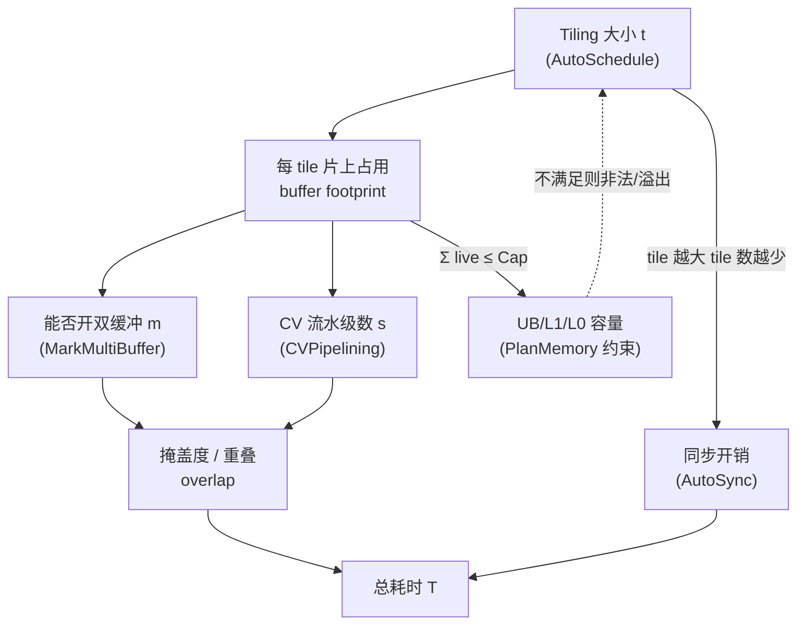
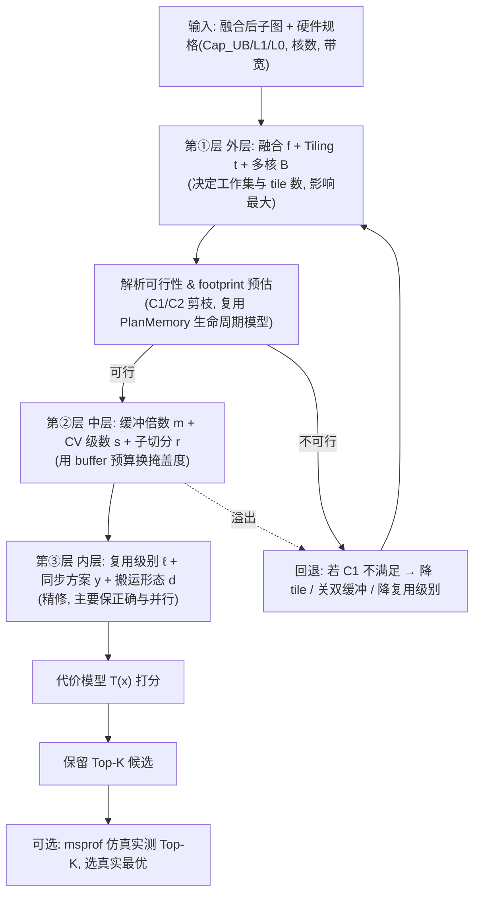

# AscendNPU-IR 编译策略寻优：建模与寻优算法设计

> 目标：把 AscendNPU-IR 的编译过程中"会影响性能的离散/连续决策"（搬运形态、Tiling、双缓冲、CV 流水掩盖、同步、内存复用等）形式化为一个**带硬件资源约束的组合优化问题**，并设计一套**分层 + 反馈**的寻优算法，在满足 UB/L1/L0 容量与对齐约束的前提下，给出最佳组合策略。
> 本文所有决策点、约束、复用/掩盖机制都对应到具体源码（`bishengir/lib/Dialect/HIVM/Transforms/...`、`.../HFusion/Transforms/AutoSchedule/...`），便于直接落地。

---

## 1. 为什么这是一个优化问题

AscendNPU-IR 后端做的事，本质是把一段张量计算映射到一个**异构、多级存储、多流水线**的硬件上。同一段计算可以有无数种合法映射，它们都正确，但性能可能差几倍。决定性能的关键决策彼此**强耦合**：



核心张力一句话：**tile 取大** → tile 数少、每 tile 流水利用率高、同步少，但**单 tile 片上占用大**，可能开不了双缓冲、甚至 UB 溢出；**tile 取小** → 能开双缓冲/CV 流水把搬运掩盖掉，但 tile 数多、固定开销与同步多。寻优就是在这条张力曲线上、在资源约束围成的可行域内，找耗时最小的点。

这正是 PlanMemory 在 UB 装不下时报的错所揭示的约束本质：

```
error: ub overflow, requires 3219456 bits while 1572864 bits available!
(possible reason: ... multi-buffer feature is enabled and some ops need extra local buffer.)
```
即 **192 KB UB**（1572864 bit）放不下开了 multi-buffer 后膨胀的工作集——决策（双缓冲）直接撞上了资源约束（UB 容量）。

---

## 2. 源码中可寻优的决策点（建模的"自变量"来源）

下表是建模的骨架：每一行是一个**决策维度**，给出它在源码中的位置、取值空间、以及它消耗/影响的资源。这保证模型不是凭空设计，而是对现有编译器可调旋钮的形式化。

| 决策维度 | 符号 | 源码位置 / Pass | 取值空间 | 主要影响 |
|---|---|---|---|---|
| 算子融合方式 | `f` | HFusion `AutoSchedule` (`FusionKind`)、`hfusion-max-horizontal-fusion-size` | PureElemwise / AnyPB / LastAxisPBR / AnyPBR；水平融合数 | 决定 kernel 边界、片上复用、工作集 |
| Tiling 切分 | `t` | `AutoSchedule::calculateTilingImpl()` 产出 `TilingCases`，按 `TilingKey` 选 | 各维 tile 大小（受 `getStrideAlignments/getTileAlignments` 约束）| tile 数、片上占用、对齐 |
| 多核绑定 | `B` | `bindLoopToMulticore` / `-block-dim` | 1..核数 | 并行度、每核负载 |
| 双缓冲(ping-pong) | `m_b` | `MarkMultiBuffer`、`-enable-auto-multi-buffer`、`multibuffer` | 每 buffer 倍数 ∈{1,2} | 掩盖搬运，UB 占用×m |
| CV 软流水级数 | `s` | `CVPipelining`、`set-workspace-multibuffer` | {1,2,4} | 掩盖 Cube/Vector，UB/Workspace ×s |
| CV 子切分比例 | `r` | `AutoSubTiling`、`tile_mix_cube_loop`/`tile_mix_vector_loop`、`hivm.tile_mix_cube_num` | CV 1:1 / 1:2 ... | Cube/Vector 负载均衡、L1 占用 |
| 片上内存复用级别 | `ℓ` | `PlanMemory` 三级复用 Level0/1/2 + Inplace | {L0,L1,L2,inplace} | 工作集大小 vs 跨流水依赖 |
| 同步方案 | `y` | `AutoSync`：InjectSync vs `-enable-hivm-graph-sync-solver` | {inject, gss}；事件ID复用 | 同步条数、并行度 |
| 搬运形态 | `d` | `HIVMDMAOps`：Load/Store/Copy/Fixpipe；ND↔NZ；`mayDiscretememaccess` 标量降级 | 离散/连续；张量/标量；布局 | 搬运量、对齐膨胀、是否进 Cube |

> 说明：`f,t,B` 在 HFusion 中端确定（AutoSchedule），`m,s,r,ℓ,y,d` 主要在 HIVM 后端确定。建模时把它们统一成一个决策向量 `x=(f,t,B,m,s,r,ℓ,y,d)`。

---

## 3. 形式化建模

### 3.1 决策向量与可行域

设一个 kernel 的决策向量

```
x = (f, t, B, m, s, r, ℓ, y, d)
```

寻优目标是在**可行域 X** 内最小化预测耗时 `T(x)`：

```
minimize   T(x)
subject to (C1) 片上容量:  对每个 scope S∈{UB,L1,L0A,L0B,L0C,BT,FP},
                          maxLive_S(x) ≤ Cap_S
           (C2) 对齐:      每个 buffer 按 align_S 向上取整 (UB/L1=32B, L0=512B, BT/FP=64B)
           (C3) 正确性:    同步方案 y 在可达性模型下可行(无死锁/不过约束)
           (C4) 合法性:    Tiling 满足 stride/size/tile-align; CV 流水满足可分离性
           (C5) 取值域:    各分量 ∈ 其离散候选集
```

### 3.2 资源约束 C1 的精确形式（来自 PlanMemory）

PlanMemory 用**生命周期（BufferLife：gen→kill）**做内存规划：生命周期不重叠的 buffer 可共享地址。所以"某一时刻活跃 buffer 的对齐后总和"才是真正受约束量，而不是所有 buffer 之和：

```
maxLive_S(x) = max over time τ of  Σ_{b 活跃于 τ, scope(b)=S}  ceil(size_b(t) / align_S) * align_S * mult_b
```

其中 `mult_b` 是 buffer b 的缓冲倍数：

```
mult_b = m_b * (s if b 跨 CV 流水级 else 1)
```

这把**Tiling(t) → 单 buffer 大小**、**双缓冲(m)/CV流水(s) → 倍数**、**复用级别(ℓ) → 活跃集合的合并程度**三件事统一进了同一个容量不等式。这就是"在满足 UB 大小等硬件资源前提下"的数学表达。

### 3.3 代价模型 T(x)：搬运与掩盖的核心

把一个核内执行看成多条流水线（pipe）并行：搬入 `MTE2`、写回 `MTE3`、向量 `V`、矩阵 `Cube`、定点输出 `FIX`。对给定 tile `t`，每 tile 在各 pipe 上的耗时：

```
τ_load(t)  = bytesLoad(t)  / BW_mte2          # 搬入
τ_store(t) = bytesStore(t) / BW_mte3          # 写回
τ_v(t)     = vecWork(t)    / Rate_v           # 向量计算
τ_c(t)     = cubeWork(t)   / Rate_cube        # 矩阵计算
τ_fix(t)   = ...                              # 定点输出
```

**(a) 无掩盖（单缓冲，m=1）**——各 pipe 串行，搬运暴露在关键路径上：

```
T_tile_serial(t) = τ_load + max(τ_v, τ_c, τ_fix) + τ_store
T(x) ≈ nTiles(t,B) * T_tile_serial(t) + SyncCost(x) + Prologue/Epilogue
```

**(b) 双缓冲掩盖（m=2）**——tile i+1 的搬入与 tile i 的计算、tile i−1 的写回重叠，稳态每 tile 取决于最慢 pipe：

```
T_tile_pipe(t) = max(τ_load, τ_v(或τ_c), τ_store)
T(x) ≈ (nTiles + (流水深度-1)) * T_tile_pipe(t) + SyncCost(x)
```
> 这就是"掩盖"：当 `τ_compute ≥ τ_load` 时，搬运被完全藏到计算后面，`T_tile` 从"加法"塌缩成"取最大"。代价是相关 buffer 翻倍（`mult_b=2`），可能撞 C1。

**(c) CV 软流水掩盖（s≥2，Mix Kernel）**——Cube 与 Vector 拆成独立 work item 并行，稳态由两者较慢者决定：

```
T_outer_iter ≈ max(T_cube_chunk(r), T_vector_chunk(r))
```
其中子切分比例 `r`（如 CV 1:2）用来让 `T_cube_chunk ≈ T_vector_chunk` 达到负载均衡；级数 `s` 提供足够的在途缓冲让两核不互等。代价是跨级 buffer `mult_b=s`，占用更多 UB/Workspace。

**(d) 同步开销**：

```
SyncCost(x) = nSyncPairs(x) * cost_sync + StallCycles(x)
```
InjectSync/GraphSyncSolver 的目标就是**最小化** `nSyncPairs` 并复用事件 ID，同时不破坏并行（不引入多余 stall）。

**(e) 搬运形态 d 的影响**：离散/非连续访存若降级为标量（`mayDiscretememaccess`）会把 `τ` 从向量化吞吐变为标量吞吐（慢但省 UB，避免末轴对齐膨胀）；ND↔NZ 布局转换会增加一次 `τ_load` 上的转换代价但让 Cube 可用。这些都体现在 `bytes*` 与 `BW/Rate` 的取值里。

### 3.4 目标与权衡的几何直观

```mermaid
flowchart LR
    subgraph 可行域 (C1 容量约束围成)
      direction TB
      P1["小 tile + 双缓冲<br/>掩盖好,但 tile 数多/开销大"]
      P2["大 tile + 单缓冲<br/>开销小,但搬运暴露"]
      OPT["最优点 x*<br/>掩盖与开销平衡, 恰好装下"]
    end
    P1 --- OPT --- P2
```

`T(x)` 沿 tile 增大先降（固定开销摊薄、利用率升）后升（装不下双缓冲、搬运暴露、甚至溢出），最优点通常在"**恰好还能开下双缓冲/CV 流水的最大 tile**"附近——这给寻优提供了强先验。

---

## 4. 寻优算法设计

### 4.1 总体思路：分层寻优 + 资源可行性剪枝 + 反馈回退

直接对 `x` 全空间穷举不现实（维度多、强耦合、且每次真实编译/上板很贵）。我们按**影响力 + 编译阶段顺序**把决策分三层，外层定大局、内层做精修，并用**解析资源模型**在committing前剪枝，用**反馈回退**处理层间耦合（对应编译器已有的"plan-memory 失败重试"行为）。



### 4.2 第①层：融合 + Tiling + 多核（候选生成 + 剪枝 + 排序）

直接复用并强化 AutoSchedule 的机制：`calculateTilingImpl()` 本就会产出**多个候选 `TilingCases`** 并按 `TilingKey`（cost/alignment）择优。我们把"择优"从简单规则升级为代价模型驱动的 beam search：

```
function SearchTilingFusion(graph, hw):
    cases = []
    for f in candidateFusionKinds(graph):                 # PureElemwise/AnyPBR/...
        kinfo = KernelInfo(graph, f)                       # IO/维度/对齐/多核能力
        # 枚举受对齐约束的 tile 候选(源码已有: alignTo(getStride/TileAlignments))
        for t in enumerateTiles(kinfo):                    # 含 small/large/不同 rank 规模
            if not satisfiesAlign(t, kinfo): continue      # C2/C4 早剪
            for B in candidateBlockDims(hw, t):            # 多核绑定
                fp = footprintPerTile(t, kinfo)            # 单 tile 各 scope 占用
                if fp.UB > Cap_UB or fp.L1 > Cap_L1: continue   # 连单缓冲都装不下 → 剪
                cases.append((f,t,B,fp))
    # 用粗代价模型(只算 τ_load/compute/store 的串行下界)排序, 取前 W 个进入第②层
    return topW(cases, key = coarseCost)
```

要点：
- **对齐剪枝前置**：把 `getStrideAlignments/getTileAlignments/alignTo` 当作可行性过滤器，先砍掉非法 tile，再算代价——和源码顺序一致。
- **多核**：`B` 越大每核负载越小、tile 越易装下双缓冲，但要保证负载可均分；多核 reduce 仅在 `analyzeMultiCoreReduceInfo()` 条件满足时启用。

### 4.3 第②层：用 buffer 预算换掩盖（背包式 DP）

给定第①层选出的 `(f,t,B)`，单 tile 的各 buffer 占用 `size_b(t)` 已知，UB 剩余预算 `Budget = Cap_UB − Σ_b align(size_b)`（即先放下单缓冲）。把"给哪些 buffer 加倍 / CV 加几级"建成**有预算的收益最大化**问题：

- 决策：对每个可缓冲 buffer b 选 `m_b∈{1,2}`；对 CV 流水选级数 `s∈{1,2,4}`。
- 成本：`extraCost_b = (mult_b−1)*align(size_b)`，需 `Σ extraCost ≤ Budget`（C1）。
- 收益：把对应 pipe 的暴露时间从"加"变"取最大"，收益 = 该 pipe 当前在关键路径上被掩盖掉的时间。

优先把预算花在**关键 pipe（当前 `τ` 最大者）相关的 buffer** 上——因为掩盖非关键 pipe 不缩短关键路径。这是一个小规模 0/1 背包，可 DP 或贪心：

```
function AllocOverlap(t, fp, budget, hw):
    # 1. 估各 pipe 时间, 找关键 pipe
    τ = pipeTimes(t, hw)                       # {load,store,v,cube,fix}
    order = buffersSortedByCriticalPipeGain(τ) # 关键 pipe 上的 buffer 优先
    m = {b:1 for b in buffers}; s = 1
    # 2. 贪心/DP: 在 budget 内, 依次给收益最大的 buffer 加倍
    for b in order:
        if (mult_gain(b) and extraCost(b) ≤ budget):
            m[b] = 2; budget -= extraCost(b)
    # 3. Mix kernel: 评估 CV 软流水级数 s 的边际收益(受 budget 与 set-workspace-multibuffer 约束)
    s = chooseCVStages(τ, budget, allowed={1,2,4})
    # 4. CV 子切分 r 让 cube/vector 负载均衡 (T_cube_chunk ≈ T_vector_chunk)
    r = balanceCVSubtiling(τ.cube, τ.v)
    return (m, s, r)
```

这一步把 PlanMemory 文档里"双缓冲提升 load/compute 重叠、但占额外 buffer"的权衡、CVPipelining"多缓冲增加 UB、需调级数"的权衡，统一成一个**预算约束下的收益最大化**子问题。

### 4.4 第③层：内存复用级别、同步、搬运形态（精修，主要保正确与并行）

**(a) 片上内存复用级别 ℓ —— 带流水权重的区间图着色**

PlanMemory 本身就是：buffer = 生命周期区间，重叠区间不能共址，给每个 buffer 赋 offset 使"同时活跃总和 ≤ Cap"。三级复用是**带不同惩罚的着色策略**：

| 级别 | 复用策略 | 惩罚/收益 | 何时选 |
|---|---|---|---|
| Inplace | 输出覆盖输入(同 scope、kill=gen、满足 ISA inplace 规则) | 零额外依赖, 省最多 | 优先 |
| Level2 | 仅同流水类型(V↔V)复用 | 不引入跨流水依赖, 但复用空间小、易失败 | 默认优先 |
| Level1 | 单缓冲若复用双缓冲的一个槽, 则把单缓冲升级为双缓冲 | 避免双缓冲被打断 stall, 但多占一块 buffer | 双缓冲场景 |
| Level0 | 任意生命周期不重叠者共址 | 复用最大, 但忽略流水结构可能伤性能 | 兜底以求装下 |

建模为**目标 = 最小化引入的跨流水依赖惩罚，约束 = 同时活跃总和 ≤ Cap**：编译器"先试高级别、失败回退低级别"正是这个带约束着色的贪心求解。寻优层只需把"复用级别"作为一个可由外层反馈调节的旋钮（装不下时允许下探到 Level0 换取可行）。

**(b) 同步方案 y —— 最小同步对 + 事件 ID 复用（可达性约束）**

把核内/核间依赖看成 DAG：跨 pipe 的每条 RAW/WAR/WAW 依赖需要一对 `set_flag/wait_flag`（或 `pipe_barrier`）。GraphSyncSolver 的目标可形式化为：

```
minimize   Σ inserted(set,wait) 对数 + 占用的 event_id 数
subject to 所有真实依赖被某条同步覆盖 (正确性)
           插入后在可达性模型下仍可行 (无死锁/不过约束)
           event_id 复用: 生命周期不冲突的同步对可共用 id
```
这是一个"**最小边覆盖 + 冲突图着色(事件 ID)**"组合问题。InjectSync 用启发式多 Pass（依赖分析→插入→搬移减 stall→删冗余→分配 ID）；GraphSyncSolver 用图算法做配对选择与 ID 复用。寻优层把 `y∈{inject,gss}` 作为候选，对**同步密集**（如 FlashAttention 类多 CV 交替）的 kernel 倾向选 `gss`（同步更省）。

**(c) 搬运形态 d**：对非连续/末轴极小的访存，评估"向量搬运(可能 UB 膨胀) vs 标量降级(`mayDiscretememaccess`，省 UB 但慢)"，按 C1 是否吃紧择优；对进 Cube 的数据决定是否插 ND→NZ。这层取值直接改变第①②层代价模型里的 `bytes*` 与 `Rate*`，因此实现上可作为一次**轻量回代**（选定 d 后重算 τ）。

### 4.5 层间耦合：反馈回退与（可选）实测在环

层间不是单向的：第②层加双缓冲可能让第①层选的 tile 超 UB；第③层复用级别变化又改变活跃集。处理方式与编译器现状一致——**失败即回退**：

```
function StrategySearch(graph, hw):
    best = ∅
    for (f,t,B,fp) in SearchTilingFusion(graph, hw):          # 第①层 Top-W
        budget = Cap_UB - baseFootprint(fp)
        (m,s,r) = AllocOverlap(t, fp, budget, hw)             # 第②层
        x = (f,t,B,m,s,r, ℓ=Level2(默认), y=auto, d=auto)
        # 解析 PlanMemory: 算 maxLive_S(x); 不满足则按优先级回退
        while not Feasible_C1(x):                              # 反馈回退
            x = relax(x)   # 顺序: 降复用级别→关部分双缓冲→降 CV 级数→缩 tile
            if x == ∅: break
        if x == ∅: continue
        x = refineInner(x)                                    # 第③层 ℓ/y/d
        score = CostModel_T(x, hw)                            # 解析代价
        best = argmin(best, (x, score))
    # 可选: 对 Top-K 用 msprof simulator 实测, 以真实耗时定胜负
    return measureAndPick(topK(best), hw) if AUTOTUNE else best
```

- `enable-tuning-mode` 关掉的正是"plan-memory 失败时反复重试编译"——对应这里的 `while not Feasible` 回退循环；调优批量编译时可关它以省时间。
- **实测在环**：解析代价模型有误差，最终精度可借 `msprof op simulator`（单算子仿真，输出 trace.json / visualize_data.bin）对 Top-K 真实测时，选最优——这就是把"模型寻优"升级为"模型剪枝 + 实测定标"的 autotuning 闭环。

### 4.6 复杂度与可行性

- 第①层 tile 候选经对齐与单缓冲容量剪枝后通常是**几十量级**（AutoSchedule 本就只产少量 `TilingCases`），取 Top-W（如 8）进入下层。
- 第②层背包规模 = 可缓冲 buffer 数（个位到十几），DP/贪心 O(#buffer × Budget) 可忽略。
- 第③层复用着色与同步求解是后端既有 Pass，复杂度多项式。
- 整体：**解析寻优一次编译内完成**；若开实测在环，仅对 Top-K（如 4）跑仿真，编译期可控。

---

## 5. 与现有实现的映射 / 落地建议

本设计不是另起炉灶，而是把编译器里**已经分散存在**的机制收拢进一个统一的"建模—剪枝—择优—回退"框架。落地路径：

| 模型组件 | 已有源码载体 | 增强落点 |
|---|---|---|
| 决策向量 `x` | AutoSchedule + HIVM 各 Pass 的选项 | 统一成一个 `StrategyConfig` 贯穿中后端 |
| 容量约束 C1 | `PlanMemory.cpp` 生命周期/三级复用 + 溢出检查 | 抽出一个**只算不改 IR 的 `estimateMaxLive()`** 供寻优前置剪枝 |
| Tiling 候选与择优 | `calculateTilingImpl()`→`TilingCases`→`TilingKey` | 把 `TilingKey` 选择改成**代价模型打分器**(可插拔) |
| 掩盖(双缓冲/CV) | `MarkMultiBuffer` / `CVPipelining` / `AutoSubTiling` | 在 `AllocOverlap` 里统一做 buffer 预算分配, 替代各自独立的开关式启用 |
| 复用级别 | `PlanMemory` Level0/1/2 + Inplace | 作为外层可反馈调节的旋钮 |
| 同步择优 | `InjectSync` / `GraphSyncSolver` | 按 kernel 同步密度自动选 `y` |
| 实测在环 | `msprof op simulator` | 对 Top-K 仿真定标, 形成 autotuner |
| 反馈回退 | 现有"plan-memory 失败重试"(由 `enable-tuning-mode` 控) | 形式化为 `relax()` 优先级序列 |

最小可用形态：先实现 `estimateMaxLive()` + 代价模型 `T(x)` + 第①②层搜索，把 `TilingKey`/双缓冲/CV 级数的选择交给它；第③层沿用现有 Pass。之后再叠加 msprof 实测在环。

---

## 6. 局限与风险

1. **动态 shape**：tile 在编译期可能是 `Expr`（`StmtExprBuilder` 生成 host 侧 tiling 函数），此时容量约束与代价需用符号上界或运行期 host tiling 求解，解析寻优要退化为"符号可行域 + 关键档位枚举"。
2. **代价模型保真度**：`BW/Rate` 受 bank 冲突、对齐膨胀、指令调度影响，纯解析有误差——故强调"模型剪枝 + 实测定标"双层。
3. **跨 kernel 全局性**：本模型以单 kernel 为粒度；`-enable-multi-kernel` 下 outline 多 kernel 时，workspace 与整图调度需要更外层的协调。
4. **耦合非凸**：层间回退是启发式，不保证全局最优；可对高价值算子放开搜索宽度 W/K 或引入更强的元启发式（模拟退火/遗传）在 Top 候选上二次寻优。

---

## 7. 小结

- **建模**：把编译过程的搬运、掩盖、Tiling、复用、同步等决策统一为决策向量 `x`，把 UB/L1/L0 容量与对齐写成以"生命周期最大活跃集"为核心的约束 C1–C5，把"搬运是否被掩盖"用**串行加法 vs 取最大**的流水代价模型 `T(x)` 精确刻画。
- **寻优**：分三层（融合/Tiling/多核 → 双缓冲/CV 掩盖 → 复用/同步/搬运精修），以解析容量模型前置剪枝、以背包式分配做 buffer 换掩盖、以失败回退处理耦合、以 msprof 实测对 Top-K 定标。
- **可落地**：每个组件都对应现有源码（AutoSchedule、PlanMemory、CVPipelining、AutoSync），本质是把已有"开关 + 启发式"升级为"统一建模 + 代价驱动 + 资源约束寻优"。
